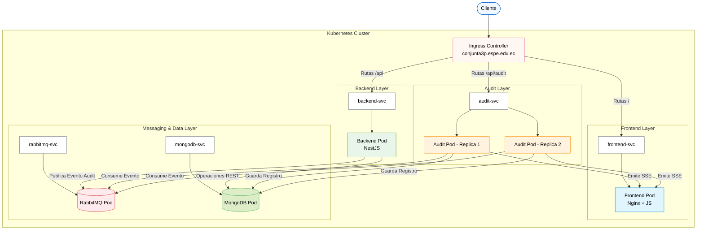

# 🍷 CavaLocal - Evaluación Conjunta

> **Marketplace de vinos basado en Microservicios con Kubernetes, MongoDB, RabbitMQ y Auditoría Distribuida**

**Universidad de las Fuerzas Armadas ESPE**

**Integrantes (Trabajo en Parejas):**
- Michael Coronado
- Kevin Panata

**Repositorio Original:** [agcudco/conjunta-distribuidas](https://github.com/agcudco/conjunta-distribuidas)

---

## 1. Diagrama de Arquitectura

La solución implementa una arquitectura de microservicios desplegada sobre Kubernetes. El siguiente diagrama ilustra los **Pods**, **Servicios** y el **Flujo de Red** interno:



### Flujo de Auditoría y Red
1. El **Cliente** realiza una petición web hacia `conjunta3p.espe.edu.ec`.
2. El **Ingress** enruta el tráfico hacia los servicios `frontend-svc`, `backend-svc` o `audit-svc` según la ruta.
3. El **Backend** procesa la solicitud, guarda los datos en **MongoDB** y publica un mensaje en **RabbitMQ** para propósitos de auditoría.
4. Las réplicas del **Servicio de Auditoría** consumen la cola en RabbitMQ de forma distribuida, almacenan un log en MongoDB y notifican al frontend en tiempo real utilizando **Server-Sent Events (SSE)**.

---

## 2. Instrucciones Paso a Paso para Levantar el Clúster

### Requisitos Previos
- Docker Desktop
- Minikube o Kind
- kubectl
- Git
- PowerShell o Terminal Bash

### Opción 1: Minikube (Recomendado)

1. **Clonar el repositorio:**
   ```bash
   git clone https://github.com/agcudco/conjunta-distribuidas.git
   cd conjunta-distribuidas
   ```

2. **Iniciar Minikube y habilitar Ingress:**
   ```powershell
   minikube start --driver=docker
   minikube addons enable ingress
   minikube addons enable dashboard
   ```

3. **Conectar Docker local con Minikube:**
   Esto permite compilar las imágenes directamente dentro de Minikube.
   ```powershell
   # En PowerShell
   & minikube -p minikube docker-env --shell powershell | Invoke-Expression
   
   # En Bash (Linux/macOS)
   eval $(minikube docker-env)
   ```

4. **Construir las imágenes:**
   ```bash
   docker build -t cavalocal-backend ./backend
   docker build -t cavalocal-audit ./audit-service
   docker build -t cavalocal-frontend ./web
   ```

5. **Aplicar los manifiestos de Kubernetes:**
   ```bash
   kubectl apply -f k8s/
   ```

6. **Verificar el estado del despliegue:**
   ```bash
   kubectl get pods
   kubectl get svc
   kubectl get ingress
   ```
   *Nota: Todos los Pods deben estar en estado **Running**.*

### Opción 2: Kind

1. **Crear el clúster con Kind:**
   ```bash
   kind create cluster --name cavalocal
   ```

2. **Construir las imágenes Docker localmente:**
   ```bash
   docker build -t cavalocal-backend ./backend
   docker build -t cavalocal-audit ./audit-service
   docker build -t cavalocal-frontend ./web
   ```

3. **Cargar las imágenes en Kind:**
   ```bash
   kind load docker-image cavalocal-backend --name cavalocal
   kind load docker-image cavalocal-audit --name cavalocal
   kind load docker-image cavalocal-frontend --name cavalocal
   ```

4. **Aplicar y verificar manifiestos:**
   ```bash
   kubectl apply -f k8s/
   kubectl get pods
   ```

### Opción 3: Script de Despliegue Automático (Minikube en Windows)
Disponemos de un script `deploy.ps1` que automatiza todo el proceso (inicio de Minikube, construcción de imágenes, despliegue de manifiestos y espera de Pods).

**Paso a paso para su ejecución:**

1. **Abrir PowerShell como Administrador:**
   Busca "PowerShell" en el menú de inicio de Windows, haz clic derecho y selecciona **"Ejecutar como administrador"**.

2. **Navegar a la carpeta del repositorio clonado:**
   ```powershell
   cd ruta\hacia\conjunta-distribuidas
   ```

3. **Habilitar la ejecución de scripts (solo si está bloqueada):**
   ```powershell
   Set-ExecutionPolicy -Scope Process -ExecutionPolicy Bypass
   ```
   *Nota: Si el sistema pide confirmación, escribe `S` (Sí) y presiona Enter.*

4. **Ejecutar el script:**
   ```powershell
   .\deploy.ps1
   ```

5. **Esperar a la confirmación:**
   El script mostrará el progreso paso a paso. Al finalizar, te indicará que todos los Pods están en estado **Running** y te presentará el sistema funcional.

---

## 3. Variables de Entorno y Configuración Segura (Secrets)

Para mantener la seguridad, el proyecto separa las configuraciones en `ConfigMaps` (datos no sensibles) y `Secrets` (credenciales), inyectándolos en los Pods de forma segura mediante `envFrom`.

### Variables Requeridas

**MongoDB:**
- `MONGO_INITDB_ROOT_USERNAME`, `MONGO_INITDB_ROOT_PASSWORD`, `MONGO_URL`

**RabbitMQ:**
- `RABBITMQ_DEFAULT_USER`, `RABBITMQ_DEFAULT_PASS`, `RABBITMQ_URL`

**Backend / Aplicación:**
- `JWT_SECRET`, `POSTGRES_DB`, `POSTGRES_USER`, `POSTGRES_PASSWORD`

### Inyección Segura mediante Kubernetes Secrets y ConfigMaps

**Paso 1:** Las configuraciones genéricas (como puertos y hosts internos) se definen en un `ConfigMap`:
```yaml
apiVersion: v1
kind: ConfigMap
metadata:
  name: cavalocal-config
data:
  RABBITMQ_HOST: "rabbitmq"
  RABBITMQ_PORT: "5672"
  MONGO_HOST: "mongodb"
  MONGO_PORT: "27017"
```

**Paso 2:** Las credenciales y claves secretas se definen en un **Secret**. Se deben codificar en **Base64** (`echo -n "admin" | base64`):
```yaml
apiVersion: v1
kind: Secret
metadata:
  name: cavalocal-secrets
type: Opaque
data:
  RABBITMQ_DEFAULT_USER: "Z3Vlc3Q="       # guest
  RABBITMQ_DEFAULT_PASS: "Z3Vlc3Q="       # guest
  MONGO_INITDB_ROOT_USERNAME: "YWRtaW4="  # admin
  MONGO_INITDB_ROOT_PASSWORD: "YWRtaW4="  # admin
  JWT_SECRET: "bXlfc3VwZXJfc2VjcmV0X2tleQ==" 
```

**Paso 3:** Se inyectan en los Deployments de forma segura usando `envFrom`, sin exponer credenciales en el código fuente:
```yaml
# Fragmento del deployment (ej: backend-deployment.yaml)
containers:
  - name: cavalocal-backend
    image: cavalocal-backend:latest
    envFrom:
      - configMapRef:
          name: cavalocal-config
      - secretRef:
          name: cavalocal-secrets
```

---

## 4. Configuración del archivo `/etc/hosts`

Para acceder a la aplicación desde tu navegador a través del **Ingress**, debes mapear la IP de tu clúster al dominio **`conjunta3p.espe.edu.ec`**.

1. **Obtener la IP del Clúster:**
   Si usas Minikube, ejecuta:
   ```bash
   minikube ip
   ```
   *(Supongamos que la IP devuelta es `192.168.49.2`)*

2. **Editar el archivo `hosts` como Administrador/Superusuario:**

   - **En Windows:** Abre el Bloc de notas como *Administrador* y edita:
     `C:\Windows\System32\drivers\etc\hosts`
   - **En Linux o macOS:** Edita con *sudo*:
     `sudo nano /etc/hosts`

3. **Agregar la siguiente línea al final del archivo:**
   ```
   # Reemplaza la IP por la obtenida en el Paso 1
   192.168.49.2    conjunta3p.espe.edu.ec
   ```

---

## 5. Accesos y Verificación

Una vez configurado todo lo anterior, el sistema estará disponible en las siguientes rutas:

- **Dashboard Principal:** [http://conjunta3p.espe.edu.ec/](http://conjunta3p.espe.edu.ec/)
- **API Backend (Swagger / Rutas REST):** [http://conjunta3p.espe.edu.ec/api](http://conjunta3p.espe.edu.ec/api)
- **Servicio de Auditoría:** [http://conjunta3p.espe.edu.ec/api/audit](http://conjunta3p.espe.edu.ec/api/audit)
