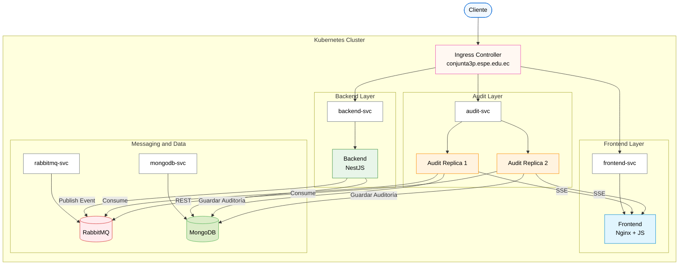

# 🍷 CavaLocal

> **Marketplace de vinos basado en Microservicios con Kubernetes, MongoDB, RabbitMQ y Auditoría Distribuida**

## Universidad de las Fuerzas Armadas ESPE

**Autores**

- Michael Coronado
- Kevin Panata

---

# Tecnologías

- NestJS
- MongoDB
- RabbitMQ
- Kubernetes
- Docker
- Nginx
- Vanilla JavaScript
- Server-Sent Events (SSE)

---

# Arquitectura

La solución implementa una arquitectura de microservicios desplegada sobre Kubernetes.

## Diagrama de Arquitectura (Pods, Services y Flujo de Red)



# Flujo de Auditoría

1. Cliente realiza una operación.
2. Backend procesa la solicitud.
3. Backend guarda información en MongoDB.
4. Backend publica un evento en RabbitMQ.
5. Servicio de Auditoría consume el evento.
6. Guarda la auditoría en MongoDB.
7. Envía el evento mediante SSE al Dashboard.

---

# Despliegue Paso a Paso

## Requisitos

- Docker Desktop
- Minikube
- kubectl
- Git
- PowerShell

## Clonar

```bash
git clone <url>
cd CavaLocal
```

## Levantar Minikube

```bash
minikube start --driver=docker
minikube addons enable ingress
minikube addons enable dashboard
```

## Construir imágenes

```bash
eval $(minikube docker-env)

docker build -t cavalocal-backend ./backend
docker build -t cavalocal-audit ./audit-service
docker build -t cavalocal-frontend ./web
```

## Aplicar manifiestos

```bash
kubectl apply -f k8s/
```

## Verificar funcionamiento

```bash
kubectl get pods
kubectl get svc
kubectl get ingress
```

Todos los Pods deben encontrarse en estado **Running**.

---

# Variables de Entorno

## ConfigMap

```yaml
apiVersion: v1
kind: ConfigMap
metadata:
  name: cavalocal-config
data:
  RABBITMQ_HOST: "rabbitmq"
  RABBITMQ_PORT: "5672"
  MONGO_HOST: "mongodb"
  MONGO_PORT: "27017"
  MONGO_DB: "audit_db"
  POSTGRES_HOST: "postgres"
  POSTGRES_PORT: "5432"
  POSTGRES_DB: "cavalocal"
```

## Secret

```yaml
apiVersion: v1
kind: Secret
metadata:
  name: cavalocal-secrets
type: Opaque
data:
  RABBITMQ_DEFAULT_USER: "Z3Vlc3Q="
  RABBITMQ_DEFAULT_PASS: "Z3Vlc3Q="
  MONGO_INITDB_ROOT_USERNAME: "YWRtaW4="
  MONGO_INITDB_ROOT_PASSWORD: "YWRtaW4="
  POSTGRES_USER: "YWRtaW4="
  POSTGRES_PASSWORD: "YWRtaW4="
  JWT_SECRET: "bXlfc3VwZXJfc2VjcmV0X2tleQ=="
```

## MongoDB

```
MONGO_INITDB_ROOT_USERNAME
MONGO_INITDB_ROOT_PASSWORD
MONGO_URL
```

## RabbitMQ

```
RABBITMQ_DEFAULT_USER
RABBITMQ_DEFAULT_PASS
RABBITMQ_URL
```

## Backend

```
JWT_SECRET
GOOGLE_CLIENT_ID
MAIL_USER
MAIL_APP_PASSWORD
POSTGRES_HOST
POSTGRES_PORT
POSTGRES_DB
POSTGRES_USER
POSTGRES_PASSWORD
```

# Secrets

Todas las credenciales se almacenan mediante **Kubernetes Secrets**.

Ejemplo:

```bash
echo -n "mi_password" | base64
```

Colocar los valores codificados dentro de `k8s/secrets.yaml`.

---

# Configuración del archivo hosts

Obtener IP:

```bash
minikube ip
```

Editar:

Windows

```
C:\Windows\System32\drivers\etc\hosts
```

Linux/macOS

```
/etc/hosts
```

Agregar:

```
IP_MINIKUBE conjunta3p.espe.edu.ec
```

---

# Accesos

- Dashboard: http://conjunta3p.espe.edu.ec/dashboard
- API: http://conjunta3p.espe.edu.ec/api
- Auditoría: http://conjunta3p.espe.edu.ec/api/audit

---

# Despliegue Automático

El proyecto incluye el script **deploy.ps1**, el cual automatiza todo el proceso.

## Ejecutar

```powershell
.\deploy.ps1
```

Si PowerShell bloquea la ejecución:

```powershell
Set-ExecutionPolicy -Scope Process -ExecutionPolicy Bypass
.\deploy.ps1
```

## El script realiza

- Inicia Minikube.
- Habilita Ingress.
- Construye imágenes Docker.
- Aplica todos los manifiestos.
- Espera que los Pods estén Running.
- Presenta el sistema completamente funcional.

## Verificación

```bash
kubectl get pods
kubectl get services
kubectl get ingress
```

Si todos los Pods están en **Running**, el sistema estará listo para utilizarse.
